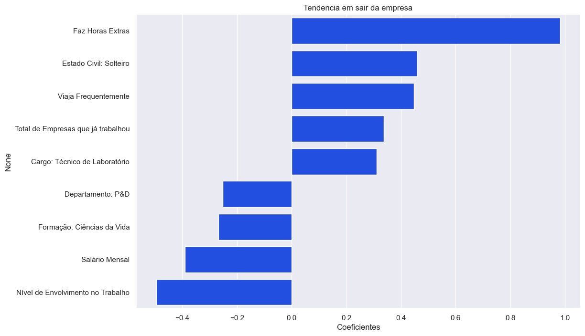

# Análise de Features relevantes da base IBM Attrition usando Machine Learning




# Sobre a base de dados

O dataset a ser utilizado é o *IBM HR Analytics Employee Attrition & Performance*, disponível no Kaggle. O dataset contém informações sobre funcionários de uma empresa fictícia, como idade, gênero, estado civil, nível de satisfação, entre outros. O objetivo é prever a probabilidade de um funcionário sair da empresa.

[Link do Kaggle](https://www.kaggle.com/datasets/pavansubhasht/ibm-hr-analytics-attrition-dataset/data)


Essa será a base de referência para o projeto de Machine Learning. Para mais detalhes, acesse a o arquivo [Sobre a Base](referencias/01_sobre_a_base.md).


# Objetivos

O objetivo do projeto é criar um modelo preditivo (Moldelo de aprendizado de Máquina, Machine Learning) simples e iterativo, que permita avaliar a **tendência do funcionário em sair ou permanecer** na empresa baseado nas informações da base de forma categórica (sim ou não) e percentual, _e.g.,_ sim, com 75%. Também faz parte do objetivo entender a **relação entre cada caractarística** (_feature_, coluna da base) com a tendência de se manter ou sair, para que seja factível a criação de um plano de ação direcionado para a empresa. 


## Organização do projeto

```
├── .gitignore         <- Arquivos e diretórios a serem ignorados pelo Git
├── ambiente.yml       <- O arquivo de requisitos para reproduzir o ambiente de análise
├── LICENSE            <- Licença de código aberto.
├── README.md          <- README principal para desenvolvedores que usam este projeto.
├── requiremnts.txt    <- Bibliotecas necessárias para execução do projeto no streamlit
├── dados              <- Arquivos de dados para o projeto.
|
├── modelos            <- Modelos treinados e serializados, previsões de modelos ou resumos de modelos
|
├── notebooks          <- Cadernos Jupyter. 
|   └──src             <- Código-fonte para uso neste projeto.
|      │
|      ├── __init__.py  <- Torna um módulo Python.
|      ├── auxiliares.py  <- Scripts auxiliares em geral.
|      ├── config.py    <- Configurações básicas do projeto.
|      ├── graficos.py  <- Scripts para criar visualizações exploratórias e orientadas a resultados.
|      ├── models_rus.py  <- Scripts para o notebook 02_Modelos_RUS_final.
|      └── models_rus.py  <- Scripts para o notebook 02_Modelos_inicial.
|
├── referencias        <- Dicionários de dados, manuais e todos os outros materiais explicativos.
|
├── relatorios         <- Análises geradas em HTML, PDF, LaTeX, etc.
│   └── imagens        <- Gráficos e figuras gerados para serem usados em relatórios
```

## Configuração do ambiente

1. Faça o clone do repositório que será criado a partir deste modelo.

    ```bash
    git clone git@github.com:Dnlsd/IbmAttrition.git
    ```

2. Crie um ambiente virtual para o seu projeto utilizando o gerenciador de ambientes de sua preferência.

    a. Caso esteja utilizando o `conda`, exporte as dependências do ambiente para o arquivo `ambiente.yml`:

      ```bash
      conda env export > ambiente.yml
      ```

    b. Caso esteja utilizando outro gerenciador de ambientes, exporte as dependências
    para o arquivo `requirements.txt` ou outro formato de sua preferência. Adicione o
    arquivo ao controle de versão, removendo o arquivo `ambiente.yml`.


# Site para iteração com o modelo desenvolvido

https://danielibmattrition.streamlit.app/


# Crétidos
## Modelo de projeto de ciência de dados

Desenvolvido por [Francisco Bustamante](https://github.com/chicolucio), para alunos iniciantes em ciência de dados de meus cursos e mentorias.

## Projeto

Adaptado do projeto desenvolvido no curso "Ciência de Dados Impressionadora" da Hashtag Treinamentos pelo professor [Francisco Bustamante](https://github.com/chicolucio)